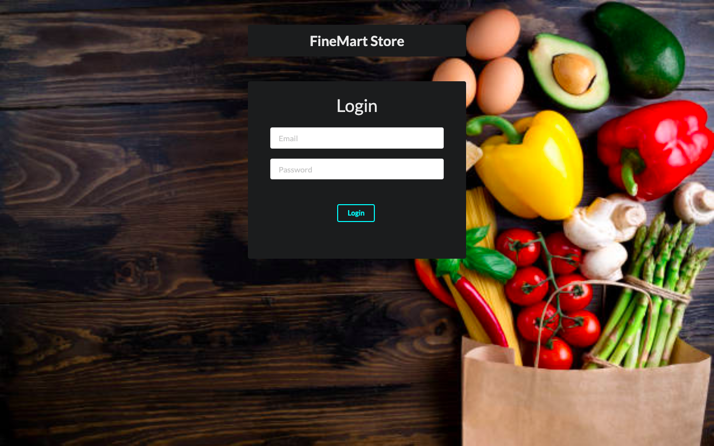
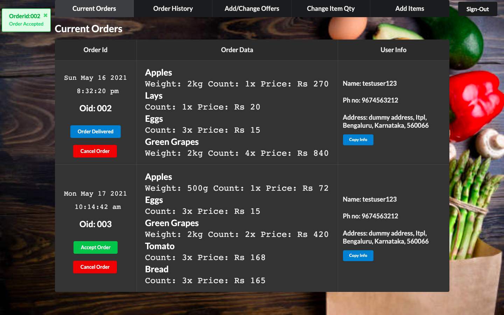
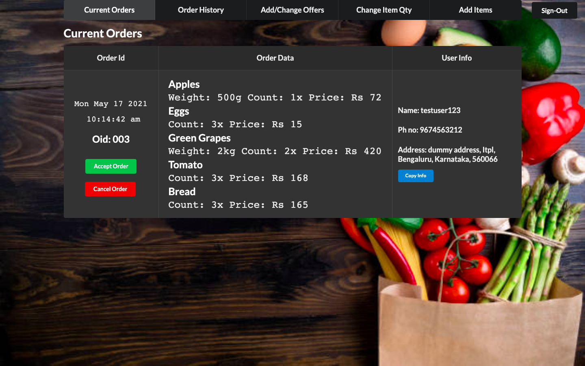
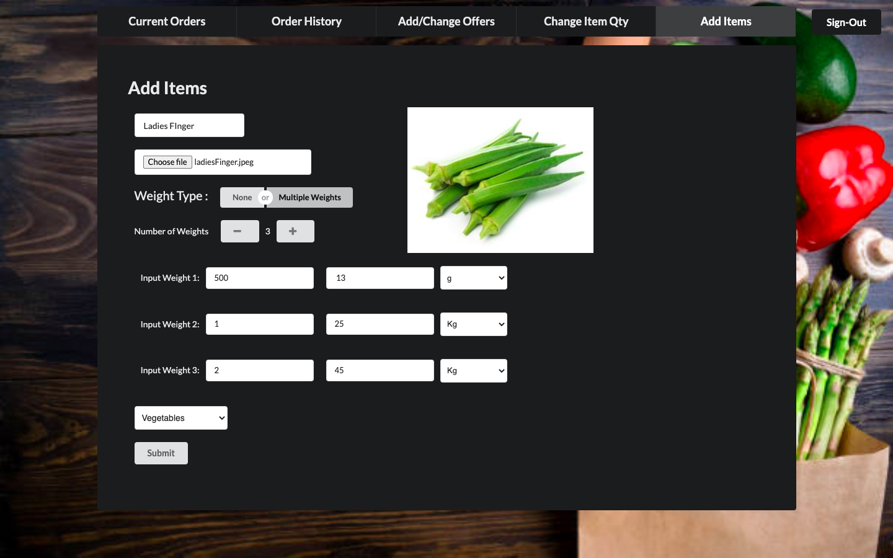

# Finemart

### Finemart is a full stack website built using react and firebase. It is a website for the finemart employees to manage all orders, add items, add offers and much more. The store is located in Marathalli Bangalore. The store consists of everyday products and at reasonable prices.
 

## Stack used 

* React for Frontend.
* Firebase as the database and server.
* Firebase-Functions for small lambda cloud functions.
* Mongodb for Full-Text search.

 
 

### Login page for the employees which is managed by firebase auth. 
---

 

### The current orders page shows all the orders that are yet to be completed. You can first accept the order or choose to cancel it. The order consists of all the items, the time at which the order was placed, and their delivery information.
---
 

 

 

### This is where you can add items. You have differnt options for different items. You can also add an item image which will be displayed for the item in the app.
---
 

 

